<div align="center">


<br/>


</div>

<br/>

<div align="center">
  <h3>Navegación Rápida</h3>
  <p>
    <a href="#stack-tecnológico">Stack</a> •
    <a href="#instalación-rápida">Instalación</a> •
    <a href="#mongodb-compass">Compass</a> •
    <a href="#colecciones-de-soundwavedb">Colecciones</a> •
    <a href="#vistas-de-la-aplicación">Vistas</a> •
    <a href="#fases-del-proyecto">Fases</a> •
    <a href="#equipo">Equipo</a>
  </p>
</div>

<br/>

<div align="center">

</div>

## Stack tecnológico

<div align="center">

| Capa | Tecnología | 
|:---:|:---:|
| **Base de datos** | -556B2F?style=flat-square&logo=mongodb&logoColor=white) |
| **Conexión BD** | -8B1E2C?style=flat-square) |
| **Backend** |  |
| **Frontend** |  |
| **Reportes** |  |
| **Versiones** |  |

</div>

<br/>

## Instalación rápida

<div align="center">

</div>

```bash
# 1. Clonar el repositorio
git clone https://github.com/Erick04A/SoundWave_ec.git
cd SoundWave_ec

# 2. Crear entorno virtual
python -m venv venv
venv\Scripts\activate        # Windows
# source venv/bin/activate   # Mac/Linux

# 3. Instalar dependencias
pip install -r requirements.txt

# 4. Configurar credenciales
copy config.example.json config.json
# Abrir config.json y completar usuario y contraseña de MongoDB

# 5. Levantar el servidor
python manage.py runserver
```

<div align="center">

### Acceder en `http://127.0.0.1:8000`

</div>

<br/>

<div align="center">

</div>

## MongoDB Compass

> La base de datos vive en **MongoDB Atlas**. Cualquier cambio hecho desde Compass se refleja **inmediatamente** en la web, y viceversa — sin caché intermedia.

<details open>
<summary><b>Conectarse a Atlas desde Compass</b></summary>
<br/>

1. Abrir **MongoDB Compass**
2. Pegar la cadena de conexión:

```
mongodb+srv://TU_USUARIO@clusterudla02.cf3j95i.mongodb.net/
```

3. Reemplazar `TU_USUARIO` y la contraseña con tus propias credenciales
4. Clic en **Connect**
5. Seleccionar la base de datos `SoundWaveDB`

</details>

<details>
<summary><b>Agregar un documento nuevo (ejemplo: nuevo usuario)</b></summary>
<br/>

1. Abrir la colección `usuarios`
2. Clic en **Add Data → Insert Document**
3. Pegar el JSON con los datos del nuevo usuario:

```json
{
  "id_usuario": 99,
  "nombre_usuario": "Nuevo Usuario",
  "email_usuario": "nuevo@soundwave.ec",
  "estado": "Activo",
  "rol": "Oyente",
  "suscripcion_activa": null,
  "albumes_guardados": [],
  "likes_canciones": [],
  "artistas_seguidos": [],
  "notificaciones": []
}
```

4. Clic en **Insert**
5. Refrescar `/administracion/` en el navegador — el usuario aparece inmediatamente

</details>

<details>
<summary><b>Buscar un documento específico</b></summary>
<br/>

En la barra de filtro de Compass escribe el criterio de búsqueda y clic en **Apply**:

```json
// Buscar por ID de usuario
{ "id_usuario": 99 }

// Buscar por email
{ "email_usuario": "mlopez@soundwave.ec" }

// Buscar por nombre
{ "nombre_usuario": "Maria Lopez" }

// Buscar suscripciones activas
{ "estado": "Activa" }
```

O desde el shell MongoDB (`>_MONGOSH`) en Compass:

```javascript
use('SoundWaveDB')
db.usuarios.findOne({ "id_usuario": 99 })
```

</details>

<details>
<summary><b>Eliminar un documento</b></summary>
<br/>

**Opción 1 — Interfaz gráfica:**
1. Aplica el filtro para encontrar el documento
2. Pasa el mouse sobre el documento
3. Clic en el ícono de **papelera** que aparece a la derecha
4. Confirmar con **Delete**

**Opción 2 — Shell:**

```javascript
db.usuarios.deleteOne({ "id_usuario": 99 })
```

</details>

<details>
<summary><b>Verificar que el cambio se refleja en la web</b></summary>
<br/>

Después de cualquier operación en Compass, simplemente refresca la página en el navegador **sin reiniciar el servidor** — los datos se sincronizan en tiempo real porque Django consulta Atlas directamente en cada request.

</details>

<br/>

<div align="center">

</div>

## Colecciones de SoundWaveDB

<div align="center">

| Colección | Documentos | Descripción |
|:---:|:---:|:---|
| `usuarios` | **27** | Oyentes, artistas y administradores |
| `artistas` | **15** | Perfiles con discografía embebida |
| `canciones` | **28** | Catálogo musical con géneros |
| `playlists` | **10** | Listas de reproducción |
| `reproducciones` | **71+** | Historial de escuchas |
| `suscripciones` | **9** | Contratos y pagos |

</div>

<br/>

## Vistas de la aplicación

<div align="center">

| Vista | URL | Acceso |
|:---:|:---:|:---:|
| Dashboard | `/` | Oyente / Admin |
| Catálogo | `/catalogo/` | Oyente |
| Historial | `/historial/` | Oyente |
| Suscripción | `/suscripcion/` | Oyente |
| Reportes | `/reportes/` | Oyente (propios) / Admin (todos) |
| Panel Admin | `/administracion/` | Solo Administrador |
| Login | `/login/` | Público |

</div>

<br/>

<div align="center">

</div>

## Fases del proyecto

```mermaid
%%{init: {'theme': 'base', 'themeVariables': { 'primaryColor': '#8B1E2C', 'primaryTextColor': '#F5F1E6', 'primaryBorderColor': '#D4AF37', 'lineColor': '#556B2F', 'secondaryColor': '#556B2F', 'tertiaryColor': '#1B1B1B'}}}%%
flowchart LR
    A["Fase 1<br/>Análisis del caso<br/>de negocio"] --> B["Fase 2<br/>Diseño lógico<br/>y físico SQL Server"]
    B --> C["Fase 3<br/>Implementación<br/>SQL Server + SP"]
    C --> D["Fase 4<br/>App Django<br/>+ pyodbc"]
    D --> E["Fase 5<br/>Diseño modelo<br/>NoSQL MongoDB"]
    E --> F["Fase 6<br/>Implementación<br/>MongoDB"]
    F --> G["Fase 7<br/>App Django<br/>+ PyMongo + Atlas"]
    G --> H["Fase 8<br/>Resumen y<br/>presentación"]
```

<div align="center">



</div>

<br/>

## Equipo

<div align="center">


<h3>Equipo 6 · Base de Datos II · UDLA 2026</h3>

<table>
<tr>
<th>Integrante</th>
<th>Rol Scrum</th>
<th>Contribución</th>
</tr>
<tr>
<td><b>Erick Quinchiguango</b></td>
<td>Scrum Master · Dev Lead</td>
<td>Arquitectura Django, PyMongo, integración, GitHub</td>
</tr>
<tr>
<td><b>Nicole Yépez</b></td>
<td>Product Owner · Documentación</td>
<td>Documentación técnica, análisis, entregables</td>
</tr>
<tr>
<td><b>Martín Gaona</b></td>
<td>Developer · Producción</td>
<td>Frontend, CSS, video de demostración</td>
</tr>
</table>

</div>

<br/>

<div align="center">


<sub><b>Base de Datos II</b> · Universidad de las Américas · 2026</sub>

</div>
